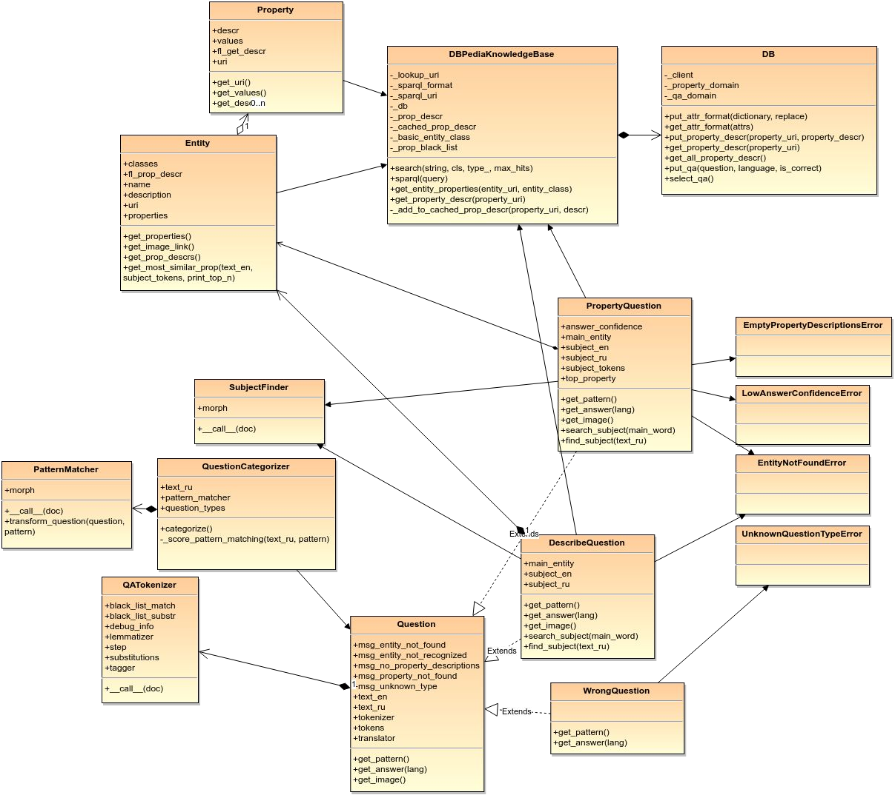

## Development of a system for access to encyclopedic knowledge in natural language

### Overview
This is the code for my Bachelor Thesis done at DNURT.

It is a question-answering system that allows to easily interact the Semantic Web using a natural language. The system uses DBpedia to obtain the necessary data in order to compose an answer. 

It supports two input modes: using keyboard and using speech.

Currently, it supports questions written / spoken only using the Russian language, but can be easily extended to other languages using Google Translate API.

Here is an example of the web interface:

And this class diagram gives an overview of the internal structure of the project:

### The technologies used in the project: 
- `SPARQL` query language to obtain data from DBpedia
- `Microsoft Translator API` for speech recognition
- `AWS SimpleDB` for storing and caching data for faster access
- `NLTK` for different text analysis tasks
- `scikit-learn` for document vectorization
- `PyMorphy2` for morphological normalization of words and part-of-speech tagging, which is used in the algorithm
- `flask` for creating a simple web-server

### Contact
For any questions regarding the code please contact Maksym Andriushchenko (m.my surname@gmail.com). 
Any suggestions regarding the project are always welcome.

